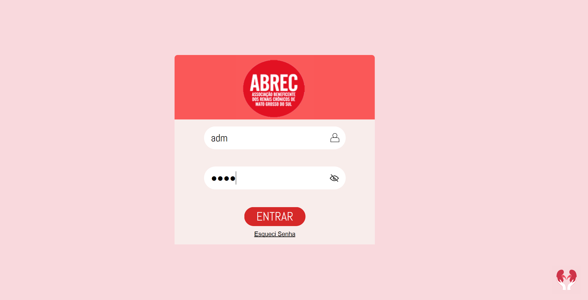
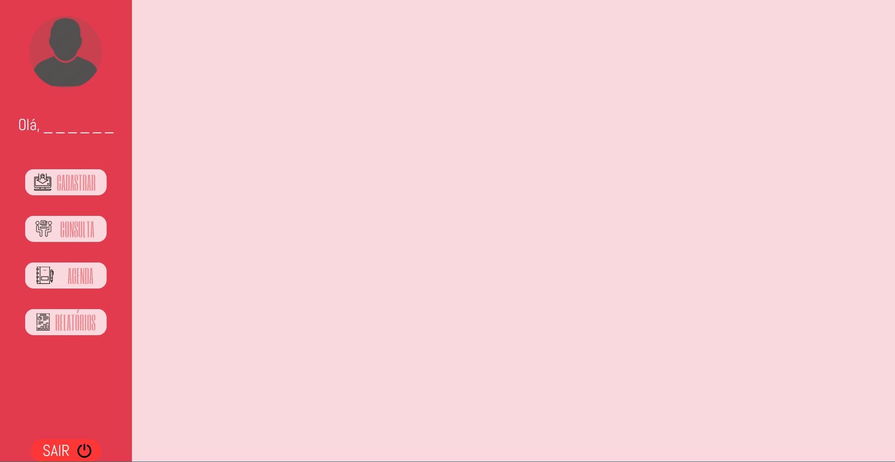

# Fabrica-SW-96
Projeto feito pela turma 96 da Fábrica de Software do Senac Hub Academy. 
Tem como objetivo facilitar a organização dos dados da Associação Beneficente dos Renais Crônicos.

## Como rodar o programa
- instalar fontes Abel e Segoe UI no google fonts
- mudar configurações de acordo com a conexão do seu banco
- pip install pyside6

### Tela de login

### Tela inicial da assistente social
